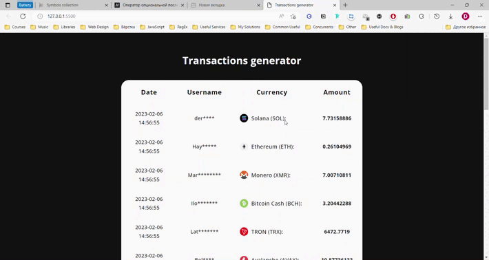

# Transaction generator

How it works?

After a random period of time a row of the table should be output.
The row contains several cells with data such as:

1. Date (in format Nov-25-2021 10:48:39 AM)
2. Username (сonsists of numbers and letters of different case);
3. Amount (generated based on limits);
4. Currency icon & name. Takes a random path to the picture and the corresponding title.

## Demo

